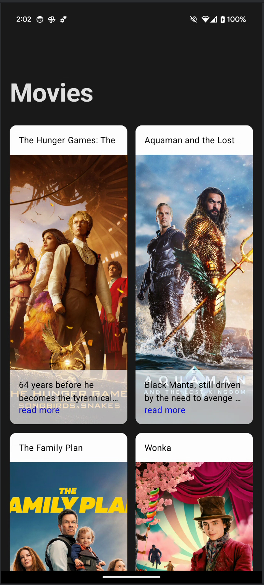
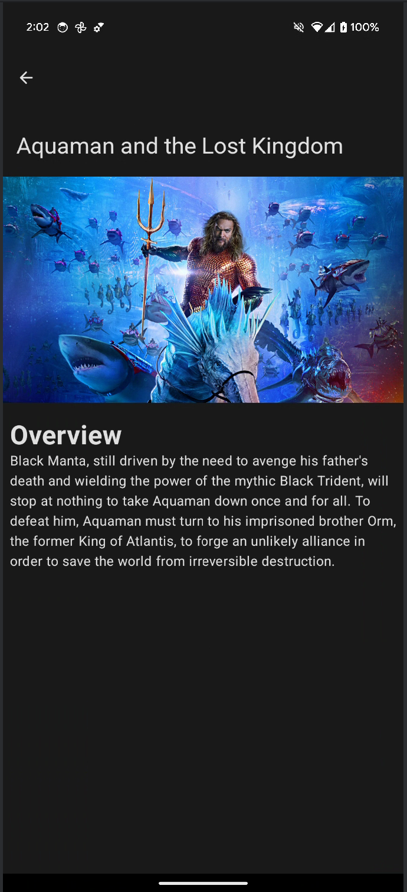

# TMDB
This is a sample project of how to load movies from the TMDB API

## ScreenShots :artist:

|                                    Movies                                     |                                    Movie                                    |
|:-----------------------------------------------------------------------------:|:---------------------------------------------------------------------------:|
|  |  |

## Features
- fetch a simple list of movies and display them on a screen
- display film details on a screen

## What is Used